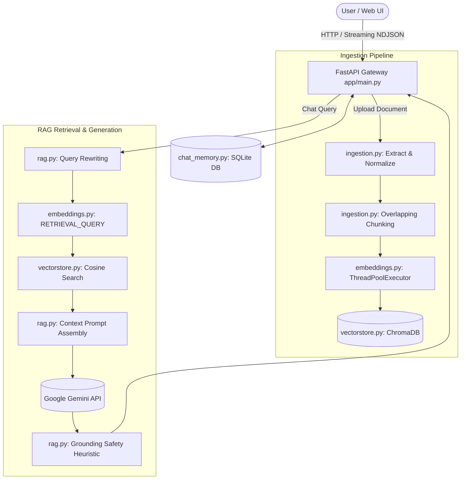

# 📚 RAG Masterclass & Architecture Blueprint
## Enterprise Retrieval-Augmented Generation with AetherMind AI

---

## 📖 Table of Contents
1. [Introduction to Retrieval-Augmented Generation (RAG)](#1-introduction-to-retrieval-augmented-generation-rag)
2. [Core Concepts & Fundamentals](#2-core-concepts--fundamentals)
   - [2.1 Why RAG? (RAG vs Fine-Tuning vs Prompting)](#21-why-rag-rag-vs-fine-tuning-vs-prompting)
   - [2.2 Document Extraction & Normalization](#22-document-extraction--normalization)
   - [2.3 Text Chunking Strategies & Overlap Math](#23-text-chunking-strategies--overlap-math)
   - [2.4 Dense Embeddings & Vector Spaces](#24-dense-embeddings--vector-spaces)
   - [2.5 Asymmetric Embeddings (Document vs Query)](#25-asymmetric-embeddings-document-vs-query)
   - [2.6 Vector Stores & Similarity Search (Cosine, L2, HNSW)](#26-vector-stores--similarity-search-cosine-l2-hnsw)
   - [2.7 Query Rewriting & Multi-Turn Context Memory](#27-query-rewriting--multi-turn-context-memory)
   - [2.8 Grounding, Citations & Hallucination Guardrails](#28-grounding-citations--hallucination-guardrails)
   - [2.9 Real-Time Asynchronous Streaming & Thread Pools](#29-real-time-asynchronous-streaming--thread-pools)
3. [System Architecture & Data Flow](#3-system-architecture--data-flow)
4. [File-by-File Technical Deep Dive](#4-file-by-file-technical-deep-dive)
   - [`app/config.py` — Centralized Configuration Management](#appconfigpy--centralized-configuration-management)
   - [`app/exceptions.py` — Application Error Hierarchy](#appexceptionspy--application-error-hierarchy)
   - [`app/logging_config.py` — Structured Logging & Performance Tracking](#applogging_configpy--structured-logging--performance-tracking)
   - [`app/models.py` — Data Schemas & Domain Enums](#appmodelspy--data-schemas--domain-enums)
   - [`app/ingestion.py` — Multi-Format Parsing & Deduplication Engine](#appingestionpy--multi-format-parsing--deduplication-engine)
   - [`app/embeddings.py` — Parallel Embedding Pipeline](#appembeddingspy--parallel-embedding-pipeline)
   - [`app/vectorstore.py` — ChromaDB Layer & KB Analytics](#appvectorstorepy--chromadb-layer--kb-analytics)
   - [`app/chat_memory.py` — SQLite Persistence, Rename & Export](#appchat_memorypy--sqlite-persistence-rename--export)
   - [`app/rag.py` — Grounded Generator, Prompts & Suggestions](#appragpy--grounded-generator-prompts--suggestions)
   - [`app/main.py` — FastAPI REST API & Streaming Gateway](#appmainpy--fastapi-rest-api--streaming-gateway)
   - [`static/index.html` — Glassmorphism UI & Knowledge Explorer](#staticindexhtml--glassmorphism-ui--knowledge-explorer)
5. [Advanced Topics & Production Optimization](#5-advanced-topics--production-optimization)
6. [Summary & Key Takeaways](#6-summary--key-takeaways)

---

## 1. Introduction to Retrieval-Augmented Generation (RAG)

Retrieval-Augmented Generation (**RAG**) is an artificial intelligence architecture that combines the power of **Large Language Models (LLMs)** with external information retrieval systems. Standard LLMs (such as Google Gemini, GPT-4, or Claude) are trained on vast datasets, but their knowledge is limited by two critical constraints:

1. **Cutoff Dates**: They do not possess knowledge of real-time or recent events past their training cutoff.
2. **Private Data Inaccessibility**: They have no access to your organization's internal documents, PDFs, private reports, or personal databases.

Trying to solve this by simply pasting massive documents directly into prompt windows causes high latency, immense token costs, and attention degradation ("lost in the middle" phenomenon).

**RAG solves this elegantly**: Instead of feeding entire documents into the LLM, RAG indexes the documents into compact numeric representations called **vector embeddings**. When a user asks a question, the system retrieves only the top 3-5 most relevant passages from the documents and feeds *only those specific passages* to the LLM alongside the question.

---

## 2. Core Concepts & Fundamentals

### 2.1 Why RAG? (RAG vs Fine-Tuning vs Prompting)

| Technique | How it Works | Primary Use Case | Cost & Maintenance | Updates | Grounding / Citations |
| :--- | :--- | :--- | :--- | :--- | :--- |
| **In-Context Prompting** | Pasting context directly into prompt | One-off small inputs (<5k words) | Cheap per query, degrades at scale | Manual | Low |
| **Fine-Tuning** | Re-training model weights on custom dataset | Changing tone, style, or syntax | Expensive, requires GPUs & data | Hard (requires re-training) | None (Hallucinates easily) |
| **RAG** | Dynamically retrieving relevant passages | Document QA, KB Search, Enterprise Search | Low cost, highly scalable | Instant (just upload/delete doc) | **100% Verifiable Citations** |

---

### 2.2 Document Extraction & Normalization

Before text can be searched, raw files must be converted into clean, standardized plain text.

1. **PDF Extraction (`pypdf`)**: Reads PDF page objects, extracts string elements per page, and preserves page-level metadata (`page_number`).
2. **DOCX Extraction (`python-docx`)**: Iterates through structural document paragraphs and extracts non-empty text runs.
3. **TXT & Markdown**: Parsed directly using UTF-8 text decoding.
4. **Text Normalization**: Control characters (non-printable ASCII) are stripped, runs of 3+ newlines are collapsed to double newlines, and consecutive spaces are normalized. This ensures uniform embedding quality without whitespace artifacts.

---

### 2.3 Text Chunking Strategies & Overlap Math

LLMs and embedding models have input token boundaries. Feeding a 100-page document as a single string destroys search precision. RAG divides documents into smaller units called **chunks**.

- **Chunk Size (`CHUNK_SIZE_WORDS = 300`)**: The number of words in each chunk window. 300 words (~400 tokens) provides enough context for a coherent topic without diluting search signals.
- **Chunk Overlap (`CHUNK_OVERLAP_WORDS = 50`)**: The number of words duplicated between adjacent chunks.

#### Why Chunk Overlap is Essential
Without overlap, critical information spanning across chunk boundaries gets split in half. For instance, if sentence A is in Chunk 1 and sentence B (which completes the thought) is in Chunk 2, neither chunk alone contains the full idea. Overlapping by 50 words ensures boundary context is preserved in both chunks.

---

### 2.4 Dense Embeddings & Vector Spaces

An **embedding** is a mathematical transformation that turns text into a high-dimensional vector of floating-point numbers (e.g., 768 floats):

`"Financial quarterly report"` $
ightarrow$ `[0.0142, -0.0891, 0.4120, ..., 0.0051]`

Semantically similar phrases map to points that are geometrically close in vector space:
- `"The company earned $5M in revenue"` and `"Quarterly profits reached five million dollars"` will have vectors positioned close together, even if they share zero common words.

---

### 2.5 Asymmetric Embeddings (Document vs Query)

Google Gemini's `gemini-embedding-001` supports **asymmetric task types**:

1. **`RETRIEVAL_DOCUMENT`**: Optimized for long document passages stored in the vector database.
2. **`RETRIEVAL_QUERY`**: Optimized for short user questions.

Because questions are structured differently than statements ("What was Q3 profit?" vs "Q3 profit was $4.2M"), training separate projection heads for document indexing vs query searching yields significantly higher search accuracy.

---

### 2.6 Vector Stores & Similarity Search (Cosine, L2, HNSW)

A **Vector Store** (such as ChromaDB) is a specialized database built for indexing high-dimensional vectors and conducting nearest-neighbor searches.

- **L2 Distance (Euclidean)**: Measures straight-line distance between two vector endpoints: $d(u,v) = \sqrt{\sum (u_i - v_i)^2}$.
- **Cosine Similarity**: Measures the cosine of the angle between two vectors: $	ext{similarity} = rac{u \cdot v}{\|u\| \|v\|}$.
- **HNSW Index (Hierarchical Navigable Small World)**: A graph-based indexing algorithm that allows sub-linear $\mathcal{O}(\log N)$ similarity searches across millions of vectors without performing brute-force comparisons.

Our similarity conversion formula:
$$	ext{Similarity Score} = rac{1.0}{1.0 + 	ext{L2 Distance}}$$

---

### 2.7 Query Rewriting & Multi-Turn Context Memory

In multi-turn chat conversations, users naturally ask follow-up questions containing pronouns:
- Turn 1: *"Tell me about project AetherMind."*
- Turn 2: *"When was it launched?"*

If we directly embed *"When was it launched?"*, vector search will search for generic launch events because `"it"` is ambiguous.

**Query Rewriting**: Before vector retrieval, an LLM pass analyzes the recent conversation history and rewrites the follow-up:
`"When was it launched?"` $
ightarrow$ `"When was project AetherMind launched?"`

This standalone question is then embedded and searched, delivering accurate context retrieval.

---

### 2.8 Grounding, Citations & Hallucination Guardrails

To eliminate hallucinations, AetherMind AI implements strict grounding rules:

1. **Strict System Prompt**: Instructs the model to answer *ONLY* using the retrieved context blocks and decline to answer if the context does not contain the information.
2. **Inline Citations**: Every fact is tagged with `[Source N]` markers.
3. **Grounding Safety Heuristic (`check_grounding`)**: Scans assistant responses to verify that either:
   - The response explicitly contains `[Source N]` citation markers, OR
   - The response contains standard refusal phrases (e.g., *"The documents do not contain..."*).
   If an answer lacks both citations and refusal markers, it is flagged with a warning badge.

---

### 2.9 Real-Time Asynchronous Streaming & Thread Pools

To stream responses token-by-token without blocking the FastAPI event loop:

1. **Producer-Consumer Queue (`asyncio.Queue`)**: A background worker thread executes the blocking Gemini streaming API generator and places tokens into an `asyncio.Queue`.
2. **Async Generator**: The FastAPI endpoint yields tokens asynchronously to the client using **NDJSON (Newline-Delimited JSON)**.
3. **Parallel Embedding Engine (`ThreadPoolExecutor`)**: Concurrent embedding of document chunks across up to 10 worker threads, ensuring 100% deterministic 1-to-1 matching between input chunks and returned vectors.

---

## 3. System Architecture & Data Flow

---

## 4. File-by-File Technical Deep Dive

### `app/config.py` — Centralized Configuration Management
- **Purpose**: Single source of truth for configuration variables loaded from `.env` via `pydantic-settings`.
- **Key Components**:
  - `Settings`: Schema defining `gemini_api_key`, `gemini_model`, `embedding_model`, `chunk_size_words`, `chunk_overlap_words`, `top_k_results`, `relevance_threshold`.
  - `@field_validator`: Validates that `chunk_overlap_words < chunk_size_words`.
  - `validate_startup()`: Warns at server launch if mandatory API keys or configurations are missing.

---

### `app/exceptions.py` — Application Error Hierarchy
- **Purpose**: Defines custom exception classes inheriting from `RAGBaseError`.
- **Classes**:
  - `RAGBaseError`: Base class carrying a human-readable `detail` message.
  - `IngestionError`: Raised during text parsing/chunking failures.
  - `EmbeddingError`: Raised when Gemini embedding API requests fail after retries.
  - `VectorStoreError`: Raised on database write/query errors.
  - `GenerationError`: Raised when LLM generation fails or returns empty responses.

---

### `app/logging_config.py` — Structured Logging & Performance Tracking
- **Purpose**: Provides colorized console output with rich tracebacks and operation timing utilities.
- **Key Components**:
  - `setup_logging()`: Initializes RichHandler logging.
  - `log_duration(logger, operation)`: Context manager measuring execution time in seconds.

---

### `app/models.py` — Data Schemas & Domain Enums
- **Purpose**: Pydantic models for request/response validation and OpenAPI documentation.
- **Key Models & Enums**:
  - `AnswerMode`: Enum (`DETAILED`, `CONCISE`, `BULLET_POINTS`).
  - `ExportFormat`: Enum (`MARKDOWN`, `JSON`).
  - `DocumentChunk`: Internal representation of a text window with chunk index, page number, and content hash.
  - `ChatRequest`, `ChatResponse`: Schemas for RAG chat interactions.
  - `SearchRequest`, `SearchResponse`: Schemas for the standalone semantic search endpoint.
  - `StatsResponse`: Comprehensive system statistics schema.

---

### `app/ingestion.py` — Multi-Format Parsing & Deduplication Engine
- **Purpose**: Extracts text from PDF, DOCX, TXT, MD files, normalizes whitespace, hashes content, and splits text into overlapping chunks.
- **Key Functions**:
  - `compute_file_hash(path)`: SHA-256 hash of raw file bytes for duplicate upload detection.
  - `extract_pages(path)`: Text extraction returning page-level tuples `(page_number, text)`.
  - `chunk_text(text, size, overlap)`: Overlapping word-count window generator.
  - `chunk_document(path)`: Full ingestion orchestration returning `(doc_id, list[DocumentChunk])`. Filters out blank/whitespace-only chunks.

---

### `app/embeddings.py` — Parallel Embedding Pipeline
- **Purpose**: Interacts with Google's `google-genai` SDK to convert text strings into 768-dimensional float vectors.
- **Key Functions**:
  - `_embed_single(text, task_type)`: Embeds a single text string with exponential backoff retries (`tenacity`).
  - `embed_documents(texts)`: Uses `ThreadPoolExecutor` (up to 10 workers) to embed chunks in parallel, guaranteeing an exact 1-to-1 match between input texts and vector embeddings.
  - `embed_query(text)`: Embeds search queries using `RETRIEVAL_QUERY`.

---

### `app/vectorstore.py` — ChromaDB Layer & KB Analytics
- **Purpose**: Manages storage, similarity search, document lifecycle, and knowledge base metrics via ChromaDB.
- **Key Functions**:
  - `add_chunks(chunks)`: Embeds and stores chunks with metadata in ChromaDB.
  - `search(query, top_k, doc_ids)`: Basic similarity search.
  - `search_with_scores(query, top_k, doc_ids)`: Similarity search returning `(DocumentChunk, relevance_score)` tuples.
  - `get_document_preview(doc_id)`: Fetches first N chunks for document preview modals.
  - `get_knowledge_base_summary()`: Computes total words, storage size, and chunk distribution.
  - `delete_document(doc_id)`: Deletes stored vector embeddings and unlinks the original file from disk.

---

### `app/chat_memory.py` — SQLite Persistence, Rename & Export
- **Purpose**: Persists chat sessions and message histories to a local SQLite database (`chat_sessions.db`).
- **Key Functions**:
  - `create_session()`, `get_session()`, `append_message()`: CRUD session operations.
  - `rename_session(session_id, title)`: Updates session titles.
  - `export_session(session_id, format)`: Formats and exports chat histories as Markdown or JSON.

---

### `app/rag.py` — Grounded Generator, Prompts & Suggestions
- **Purpose**: Core orchestration of query rewriting, context prompt assembly, LLM streaming, grounding checks, and prompt suggestions.
- **Key Functions**:
  - `rewrite_query_async(history, question)`: Resolves conversation context into standalone search queries.
  - `answer_question_stream_async(...)`: Async producer-consumer streaming generator using `asyncio.Queue`.
  - `check_grounding(answer, num_sources)`: Evaluates citation presence vs refusal phrases.
  - `generate_suggestions(doc_names)`: Generates smart contextual prompt suggestions based on uploaded document names.

---

### `app/main.py` — FastAPI REST API & Streaming Gateway
- **Purpose**: Mounts HTTP endpoints, security headers, rate limiters (`slowapi`), CORS, and static UI files.
- **Key Endpoints**:
  - `POST /api/v1/documents/upload`: Uploads and ingests files.
  - `GET /api/v1/documents/{doc_id}/preview`: Preview document chunks.
  - `POST /api/v1/search`: Standalone semantic search.
  - `POST /api/v1/chat/stream`: Async token-by-token RAG streaming (NDJSON).
  - `PATCH /api/v1/sessions/{session_id}/rename`: Rename chat session.
  - `GET /api/v1/sessions/{session_id}/export`: Export chat history.
  - `GET /api/v1/suggestions`: Prompt suggestions.
  - `GET /api/v1/stats`: System metrics.

---

### `static/index.html` — Glassmorphism UI & Knowledge Explorer
- **Purpose**: Modern ChatGPT-style single-page frontend.
- **Features**:
  - Glassmorphism dark mode with animated mesh background.
  - Dual Views: **Chat View** (streaming QA) and **Knowledge Explorer View** (semantic chunk search).
  - Modal dialogs for Document Preview and System Settings.
  - Inline double-click session renaming.
  - Message actions (copy text, copy code, regenerate).
  - Keyboard shortcuts (`Ctrl+N`, `Ctrl+K`, `Escape`).

---

## 5. Advanced Topics & Production Optimization

1. **Hybrid Search (Dense + Sparse/BM25)**: Combining vector semantic search with BM25 keyword search for acronyms or product codes.
2. **Re-Ranking (Cross-Encoders)**: Using a re-ranker model (e.g., Cohere Rerank) to re-order top 20 initial vector results before prompt assembly.
3. **Semantic Chunking**: Splitting documents by semantic sentence similarity rather than fixed word counts.
4. **Vector Database Scaling**: Transitioning from local ChromaDB to distributed vector stores (Qdrant, Milvus, or Pinecone) for multi-million document scaling.

---

## 6. Summary & Key Takeaways

- **RAG eliminates hallucinations** by forcing LLMs to answer strictly from retrieved document facts.
- **Overlapping chunking** prevents context loss across window boundaries.
- **Asymmetric embeddings** optimize document storage vs query matching.
- **Parallel embedding** ensures 1-to-1 chunk-to-vector mapping and eliminates length mismatches.
- **Async producer-consumer queues** deliver real-time streaming without blocking event loops.

---
*Created for AetherMind AI — Enterprise Knowledge Platform Blueprint*
