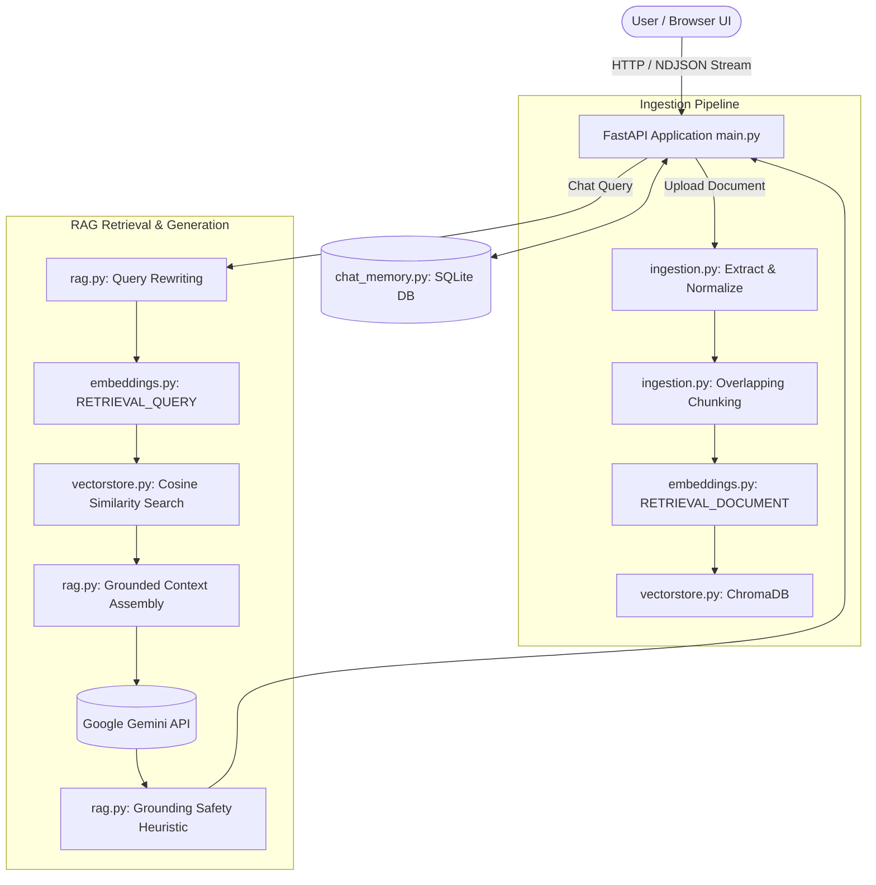

# 🤖 RAG Chatbot

[](https://www.python.org/downloads/)
[](https://fastapi.tiangolo.com/)
[](https://opensource.org/licenses/MIT)

An enterprise-grade, production-ready **Retrieval-Augmented Generation (RAG)** chatbot. Upload documents (`.pdf`, `.docx`, `.txt`, `.md`), store vector embeddings locally with ChromaDB, and generate grounded answers with source citations using Google Gemini.

> 📍 Open the Web UI in your browser at `http://127.0.0.1:8000` after starting the server!

---

## 🌟 Key Features

- **Multi-Format Ingestion**: Full text extraction and overlapping word-window chunking for PDF, DOCX, TXT, and Markdown files.
- **Asymmetric Vector Embeddings**: Uses Google's `gemini-embedding-001` with `RETRIEVAL_DOCUMENT` for chunk storage and `RETRIEVAL_QUERY` for search.
- **Local Persistent Vector Store**: Stored on disk via ChromaDB with SHA-256 duplicate detection and document cleanup.
- **Query Rewriting & Chat Memory**: Context-aware multi-turn conversation memory backed by SQLite; follow-up questions are automatically rewritten into standalone search queries.
- **Strict Grounding & Citations**: Prompts force Gemini to answer strictly from retrieved context and provide `[Source N]` references, complete with page numbers.
- **Modern Streaming UI**: ChatGPT-style glassmorphism interface featuring sidebar chat history, document selection filters, live NDJSON streaming token rendering, and toast notifications.
- **Enterprise Ready**: Full FastAPI v1 API routing, OpenAPI docs, rate limiting, structured logging, docker-compose configuration, and comprehensive unit/integration test coverage.

---

## 🏗️ Architecture



---

## 🚀 Quick Start

### 1. Prerequisites
- Python 3.11+
- A Google Gemini API key (get one free at [Google AI Studio](https://aistudio.google.com/apikey))

### 2. Local Setup

```bash
# Clone repository
git clone https://github.com/your-username/rag-chatbot.git
cd rag-chatbot

# Create and activate virtual environment
python -m venv venv
source venv/bin/activate  # On Windows: venv\Scripts\Activate.ps1

# Install dependencies
pip install -r requirements.txt

# Configure environment variables
cp .env.example .env
# Edit .env and paste your GEMINI_API_KEY
```

### 3. Run Application

```bash
uvicorn app.main:app --reload
```

Navigate to **http://127.0.0.1:8000** in your browser.

---

## 🐳 Docker Deployment

Run with Docker Compose:

```bash
docker-compose up --build -d
```

---

## ⚙️ Configuration Reference (`.env`)

| Variable | Default | Description |
|---|---|---|
| `GEMINI_API_KEY` | *(required)* | Your Google Gemini API Key |
| `GEMINI_MODEL` | `gemini-2.5-flash` | Gemini model for query rewriting and answer generation |
| `EMBEDDING_MODEL` | `gemini-embedding-001` | Model for embedding document chunks & queries |
| `CHUNK_SIZE_WORDS` | `300` | Words per text chunk window |
| `CHUNK_OVERLAP_WORDS` | `50` | Duplicated words between adjacent chunks |
| `TOP_K_RESULTS` | `5` | Number of relevant chunks retrieved per question |
| `MAX_FILE_SIZE_MB` | `20` | Maximum upload size per document |
| `MAX_DOCUMENTS` | `50` | Document storage limit |

---

## 🧪 Running Tests

```bash
pip install -r requirements-dev.txt
pytest test/ -v
```

---

## 📜 License

Distributed under the MIT License. See [`LICENSE`](file:///d:/rag-chatbot/LICENSE) for details.